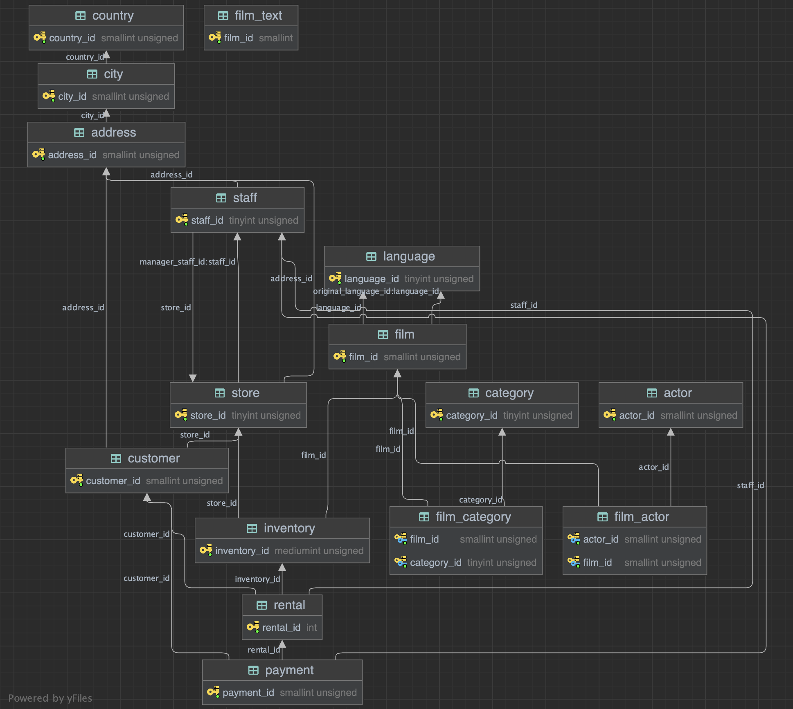

>>>>>><h1>Hibernate </h1>
>>>
>>><h4>1. Create and map all entities</h4>
>>><h4>2. Add DAO classes</h4>
>>><h4>3. Add a transactional method that can create a new customer with all dependent fields</h4>
>>><h4>4. Add a transactional method that describes the event “the buyer went and returned a previously rented movie"</h4>
>>><h4>5. Add a transactional method that describes the event “the buyer went to the store and rented inventory there"</h4>
>>><h4>6. Add a transactional method that describes the event “a new movie was made, and it became available for rent”</h4>